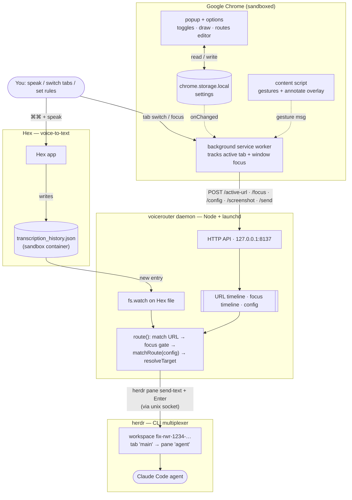
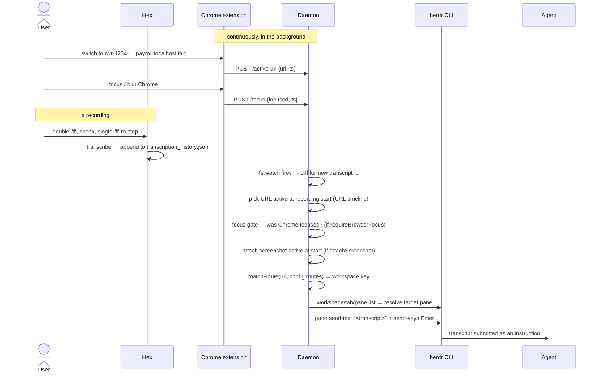

# Architecture

Voice Router delivers a [Hex](https://github.com/kitlangton/Hex) voice transcript to the
right Claude Code agent pane in [herdr](https://herdr.dev), chosen by the **browser tab you
were looking at when you spoke** — so you never have to manually focus the correct pane.

## The problem

You run many Claude Code instances across herdr worktrees. When you dictate with Hex, the
text lands wherever the OS cursor is — forcing you to first focus the right pane. Voice
Router removes that step: it watches what you transcribe and routes it to the agent that
matches your current browser context.

## Moving parts

| Component | Tech | Role |
|---|---|---|
| **Hex** | macOS app (external) | Voice→text. Writes each transcript to `transcription_history.json` in its sandbox container. We only *read* this file. |
| **Chrome extension** | MV3 (TypeScript→esbuild) | A *sensor*: streams the active tab's URL + window-focus state (and, optionally, a screenshot of the tab) to the daemon, holds user settings, shows status. Makes **no routing decisions**. |
| **voicerouter daemon** | Node (TypeScript→esbuild), launchd agent | The *brain*: watches Hex's file, matches each new transcript to a URL + routing rule, and delivers it via the herdr CLI. |
| **herdr** | CLI multiplexer (external) | Hosts the workspaces/tabs/panes where Claude Code agents run. Driven over its local unix socket. |

### Why this split

The extension is sandboxed — it **cannot read files or run CLIs** — so the real work must
live in a local process. The daemon is also the only component that observes Hex. Keeping
the extension "dumb" is deliberate: the MV3 service worker is evicted frequently, so no
decision logic or state is stranded there. See the data-flow note below.

## System flow



## One recording, end to end



## How routing is decided (all daemon-side)

For each new transcript the daemon, in `route()` / `deliverToHerdr()`:

1. **Attribute a URL** — the tab active during the recording window, from the URL timeline
   (anchored at recording *start*; duration/temporal scoring is the fallback matcher).
2. **Focus gate** — if `requireBrowserFocus`, skip unless Chrome was focused at that moment
   (from the focus timeline).
3. **Match a rule** — first `config.routes` entry whose `urlPattern` matches; `{workspace}`
   captures the herdr workspace key (e.g. `rwr-1234-heardroom`).
4. **Resolve the pane** — find the herdr workspace (label/worktree, tolerant of a `fix-`
   prefix) → tab `tabName` → pane `paneName`.
5. **Deliver** — `herdr pane send-text` + `send-keys Enter` into that pane.

URLs matching no rule, or recordings made while unfocused (when gated), are dropped.

## Optional: page screenshots

When `attachScreenshot` is on, the agent gets to *see* the page you were looking at, not
just its URL. A terminal can't receive an image, so we hand Claude Code a **file path** and
let it read the image itself:

1. **Capture** — the extension grabs the visible tab (`chrome.tabs.captureVisibleTab`, JPEG)
   on the same tab-activate / focus / load events that already report the URL (throttled),
   and POSTs the data URL to `/screenshot`. Off by default; zero capture cost until enabled.
2. **Store** — the daemon writes each shot to a file under `SCREENSHOT_DIR` and keeps a
   small time-indexed timeline of *paths* (not pixels), pruned by count + TTL.
3. **Attribute** — at route time it picks the shot active at the recording *start* (mirroring
   the URL timeline), discarding one too stale to be the page in question.
4. **Reference** — it prepends `Screenshot of my current browser tab (read this image file):
   <path>` to the transcript before delivery. Claude Code opens the image when it runs.

This needs the `<all_urls>` host permission (required by `captureVisibleTab`), and
`SCREENSHOT_DIR` must be readable by the agent process (it runs as the same user).

## Optional: drawing on the page

To make a prompt more precise ("make **this** bigger" + an arrow + a label), the content
script overlays a transparent full-viewport `<canvas>` with three tools — a freehand **Pen**,
a **Text** tool (click empty space to type; click an existing label to drag it), and a
**Rectangle** tool (drag to draw; click a rect to select, then drag the body to move or a
corner handle to resize). Everything is one item list on the canvas (text rasterized with
`textBaseline='top'`; entry via a temporary `contentEditable` box; move/resize hit-test
against measured bounds and corner handles). Because the canvas is part of the rendered
viewport, the captured screenshot includes the annotations — no special compositing. The
toolbar and the rect selection handles are hidden during capture so they stay out of the shot.
Tools have keyboard shortcuts in draw mode (**P** pen, **T** text, **R** rect), shown as
keycaps on the toolbar buttons; they're suppressed while typing in a text box.

- **Toggle** — the popup's "Draw on this page" button messages the active tab's content
  script (`{type:'draw', on}`); enabling it also flips `attachScreenshot` on (else the
  annotation reaches no one). Per-tab, transient (resets on navigation).
- **Capture timing** — the ⌘⌘ gesture can't be relied on (the target app iframes its
  content, so keyboard events never reach the content script). So the annotated frame is
  captured on **stroke-pause** (debounced after you draw / type / move / resize — pointer-
  driven, always reliable) and on Send; the background does the actual `captureVisibleTab`.
- **Lifecycle / clear-on-send** — annotations persist until you exit (the **Cancel** button
  or the popup toggle — deliberately *not* `Esc`, which is too easy to hit) or a voice command
  is sent. Because the gesture is unreliable, clearing after a sent command is driven by the
  background **watching the daemon's `lastMatch`** while a tab is in draw mode: a new routed
  transcript → it messages the tab to clear + exit.
- **Send button** — delivers the annotated screenshot to the matching pane immediately
  (no voice) via `POST /send`: the toolbar hides, the background captures + delivers, and on
  success the drawing clears and exits (failures flash the reason in the toolbar).

## Interfaces

**Hex store** (read-only, live-verified):
`~/Library/Containers/com.kitlangton.Hex/Data/Library/Application Support/com.kitlangton.Hex/transcription_history.json`
— JSON `{ history: [{ id, timestamp (Apple-epoch s), text, duration, audioPath, … }] }`.

**Daemon HTTP API** (`127.0.0.1:8137`, loopback only):

| Method | Path | Purpose |
|---|---|---|
| GET | `/health` | status, transcript + screenshot counts, current URL, focus, config, last match |
| POST | `/active-url` | extension → URL timeline |
| POST | `/screenshot` | extension → screenshot store (data URL → file on disk; opt-in) |
| POST | `/focus` | extension → focus timeline |
| POST | `/config` | extension → settings (Zod-validated; 400 on bad input) |
| POST | `/recording` | optional gesture hints (start/finish/abort) |
| POST | `/match` | debug: best transcript for an explicit time window |
| POST | `/route-test` | debug: run gate→resolve→deliver for a URL (dry-run by default) |
| POST | `/send` | deliver the latest screenshot to the pane matching a URL, no voice (Send button) |
| GET | `/transcripts/latest` | debug peek |

**chrome.storage.local** — `settings: { requireBrowserFocus, attachScreenshot, routes[] }`.
The extension is the source of truth; it pushes to `/config` on startup, on change, and each
health tick.

**herdr** — controlled via the `herdr` CLI over `~/.config/herdr/herdr.sock` (works from
outside herdr because every call targets explicit ids).

## Config & schema

The config exchanged between extension and daemon is validated by a **shared Zod schema**
(`shared/config-schema.ts`) — `ConfigSchema` / `RouteSchema`, with inferred TS types — so
both sides agree on shape. Fields are optional to preserve the daemon's partial-merge.
Defaults differ intentionally by call site: daemon `requireBrowserFocus=false` (permissive
until the extension syncs), extension default `true`. `attachScreenshot` (default off both
sides) gates the screenshot/drawing capture; the extension flips it on when you start drawing.

## Build & deploy

- **TypeScript** everywhere; `tsc --noEmit` type-checks (base + per-target leaf configs).
- **esbuild** bundles both sides (Zod inlined, no runtime `node_modules`): daemon →
  `daemon/dist/server.js` (node/cjs); extension → `extension/dist/*.js` (browser/iife).
- **`install.sh`** runs `npm install && npm run build`, then installs the daemon as a
  **launchd LaunchAgent** (`RunAtLoad` + `KeepAlive`, absolute node/herdr paths baked in).
- The **extension** is loaded unpacked from `extension/` (references `dist/*.js`).

## Source map

```
shared/config-schema.ts     Zod schema shared by both sides
shared/url-match.ts         URL-pattern matcher shared by daemon (routing) + popup (current-tab rule)
daemon/src/
  server.ts                 HTTP API, timelines, watcher, route(), boot
  hex.ts                    read/normalize transcription_history.json
  matcher.ts                URL-for-transcript + explicit-window matchers
  screenshots.ts            optional page-screenshot store (data URL → file, attribution)
  herdr.ts                  CLI wrapper, URL-pattern compiler, workspace/tab/pane resolve
  config.ts                 ports, paths, tunables
extension/src/
  background.ts             URL/focus + screenshot streaming, draw capture/send + clear-watch, config sync
  content.ts                recording-gesture detection + annotation overlay (pen/text/rect, move/resize)
  popup.ts / options.ts     status (daemon/hex/last-match/current-tab rule) + toggles + draw / routes editor
build.mjs · tsconfig*.json · install.sh · uninstall.sh
```
